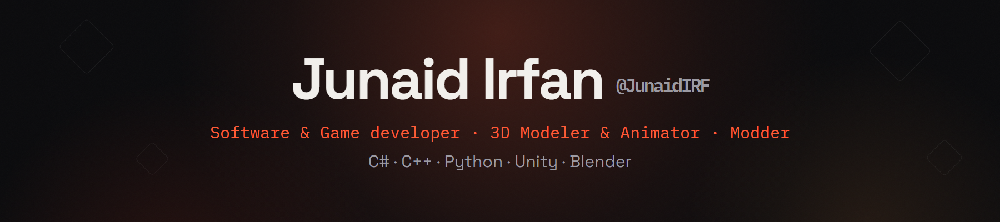

  

  <a href="https://junaidirf.github.io/"><strong>junaidirf.github.io</strong></a>

  
  
  
  
  
  
  

---

- 🎮 **Games:** Unity and C#, with models and animation I make myself
- 💻 **Software:** desktop apps, backend APIs and automation in C#, C++ and Python
- 🔧 **Mods:** reverse-engineered plugins for games that never shipped the feature
- 🎓 CS student at COMSATS Wah, open to work and commissions

---

### Tech

  

---

  Reach me at <a href="mailto:junaidirf005@gmail.com"><strong>junaidirf005@gmail.com</strong></a> or <strong>junaidirf</strong> on Discord

